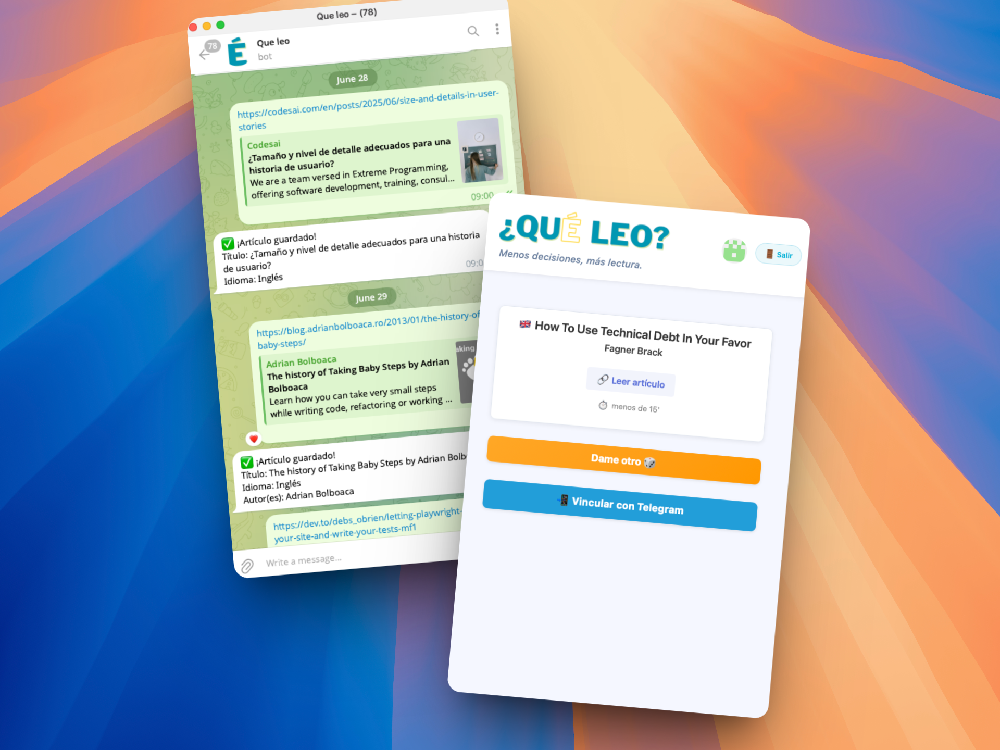

# ¿Qué leo? 📚

> **Descubre qué leer de tu lista interminable de artículos guardados**

## 🎯 ¿Qué resuelve?

Todos tenemos esa lista interminable de artículos técnicos que guardamos con la intención de "leer después"... pero que nunca leemos. **¿Qué leo?** resuelve ese problema sugiriéndote qué leer de tu colección de forma aleatoria.

### ✨ Características principales

- 🔄 **Selección aleatoria**: Descubre artículos olvidados en tu lista
- 📱 **Integración con Telegram**: Guarda artículos fácilmente desde tu móvil
- 👤 **Autenticación con GitHub**: Login seguro y rápido
- 📊 **Gestión completa**: Añade, elimina y marca artículos como leídos

## 📱 Integración con Telegram

### ¿Cómo funciona?

1. **Vincula tu cuenta**: Haz clic en "Vincular con Telegram" en la app web
2. **Autoriza el bot**: El bot de Telegram te pedirá autorización
3. **Envía enlaces**: Manda cualquier URL al bot y se guardará automáticamente
4. **¡Listo!**: Tus artículos aparecerán en la app web

### 💡 Casos de uso

- 📖 **Lectura móvil**: Encuentras un artículo interesante navegando desde el móvil
- 🚇 **Tiempo muerto**: Guarda artículos durante el trayecto en transporte público
- 💬 **Compartir**: Envía enlaces desde chats de Telegram directamente a tu lista

## 🤝 Contribuir

¡Las Pull Requests son más que bienvenidas! 🎉

Este es un proyecto de aprendizaje personal, pero si encuentras algún bug, tienes sugerencias de mejora o quieres añadir nuevas funcionalidades, ¡no dudes en abrir un issue o enviar una PR!

Todas las contribuciones son valoradas y ayudan a mejorar la experiencia de todos los usuarios.

---

**Desarrollado con ❤️ para resolver el problema universal de la lista infinita de artículos por leer**
