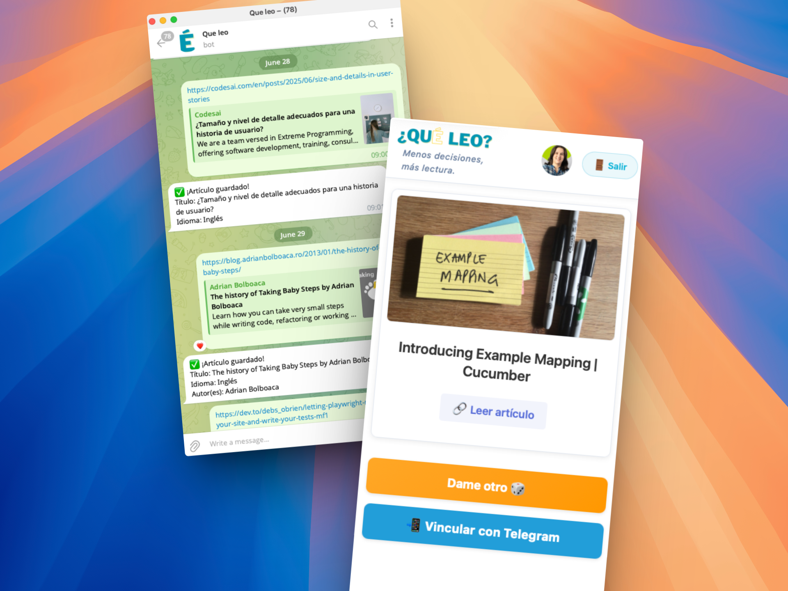

# ¿Qué leo? 📚

Una aplicación para gestionar y descubrir qué leer de tu lista de artículos guardados.

## Descripción

Todos tenemos esa lista interminable de artículos técnicos que guardamos con la intención de "leer después"... pero que nunca leemos. 
Esta aplicación resuelve ese problema sugiriéndote qué leer de tu colección. 

Este proyecto es una forma de poner en práctica lo aprendido sobre Arquitectura hexagonal gracias al curso de Codely "Arquitecture Hexagonal en el front"

### Licencia

MIT License - Siéntete libre de usar este código para tus propios proyectos de aprendizaje.
